# Lab 1 : Build Alexa device on a MCU

In this lab, you will learn how to create a Alexa Voice Product. Then you will create the AWS resources required for the upcoming labs. 

## <span style="color:orange"> You will build step 1a of this architecture :</span>
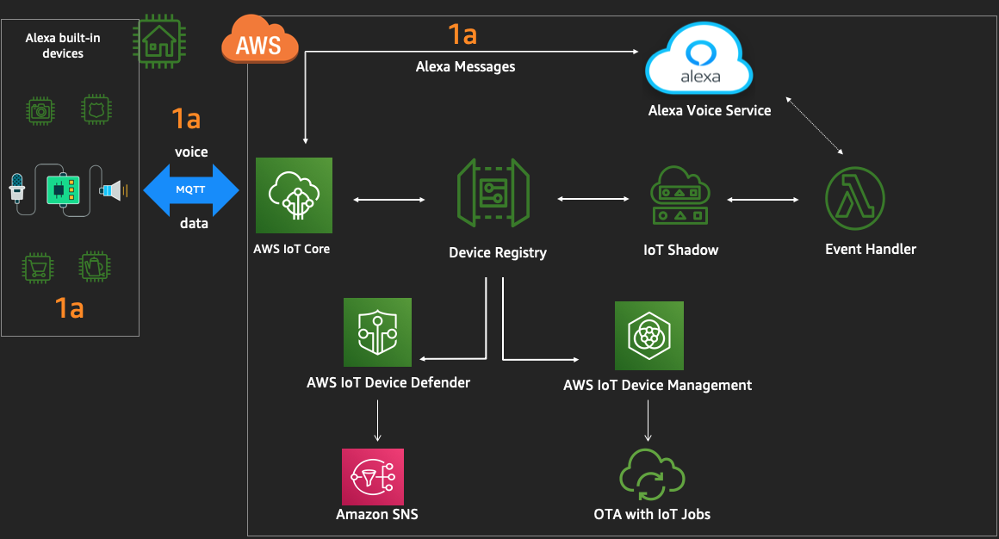

## A.  Identify Serial number of the NXP kit and configure WiFi

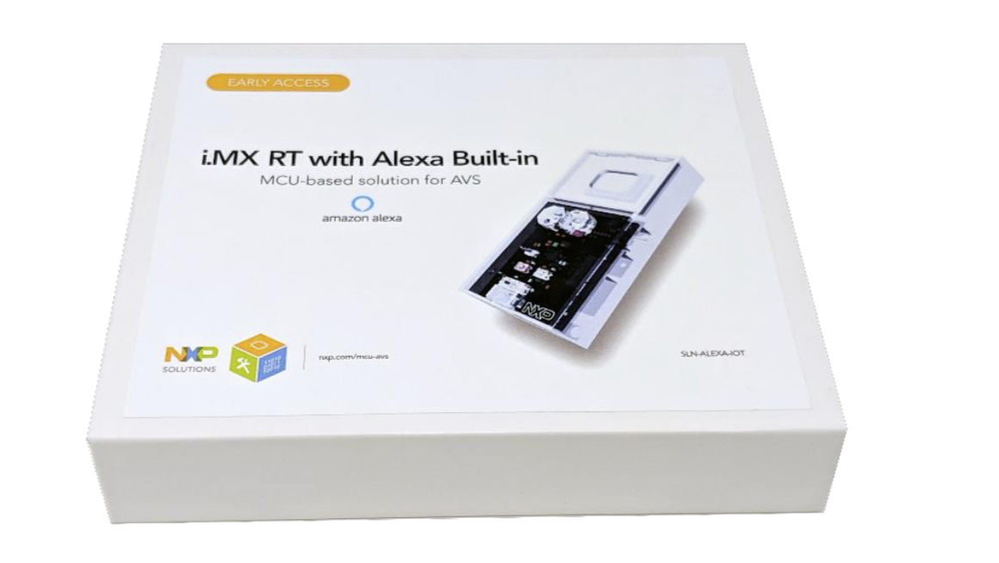

## <span style="color:orange"> You need to establish serial connection to the device : </span>

1. Please connect both the USB ports to the adapter provided, and connect the adapter to the laptop. 
    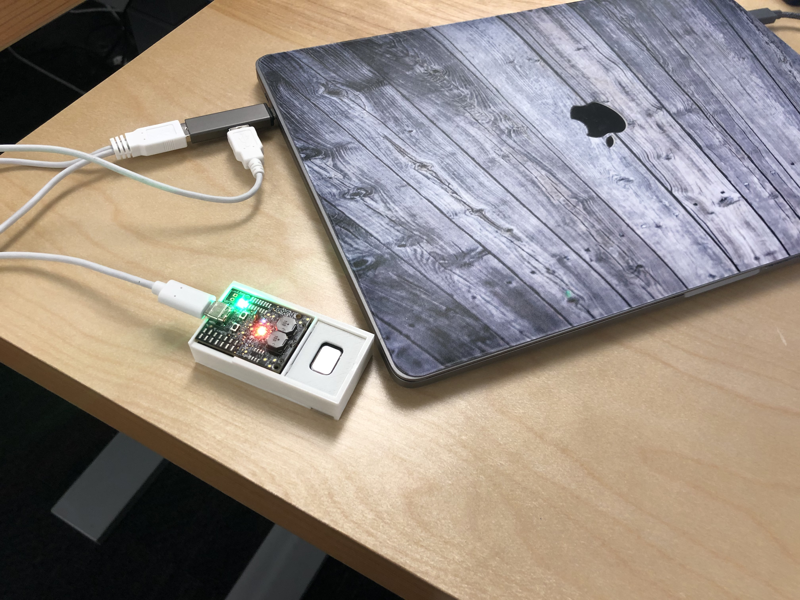 


2. Connect to the hardware kit using the below instructions - 
    -   Mac -  [screen](./serial.md)
    -   Windows - [putty](./serial.md)
    -   Linux -  [screen / minicom](./serial.md)


2. Read the below and then run the commands to configure the kit to connect to Alexa Voice Services and AWS IoT services. 
    
    - *Client id* and *Product Id* is required for the kit to successfully authenticate to Alexa Voice service 
    - *AWS Account ID* and *Endpoint URL* is required for the kit to successfully authenticate to AWS IoT core
    - Therefater you enable [*code based linking*](https://developer.amazon.com/docs/alexa-voice-service/code-based-linking-other-platforms.html) for registering this kit to your Amazon Developer account 
    - Reset reboots the device with the latest confiigurations 

    Please enter the commands similar to the screenshot below **One by One**

    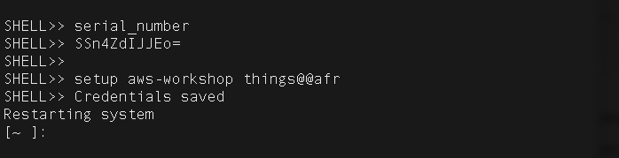 

    ```
    serial_number

    setup aws-workshop things@@afr
    ```

    Please **record** the serial number of the device. After you will issue setup command device will restart.
    If you experience strange behaviour in the MacOS Terminal, please issue following commands
    
    ```
    stty sane
    stty erase [press the Backspace key]
    
    ```

## B.  Create AWS resources 

1. Login to AWS Console 
    -   Launch [Team Dashboard](https://dashboard.eventengine.run/dashboard)
    - Paste the 12 digit Hash key provided to you by AWS 
    - Click Accept Terms & Login

    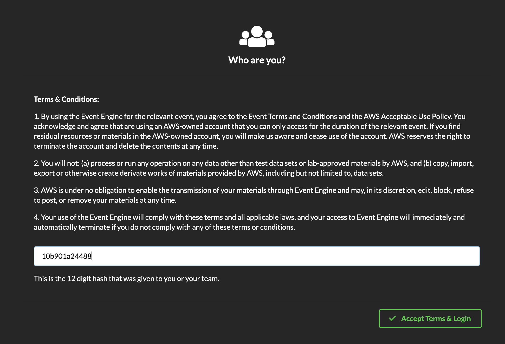

2. Next, Copy the Account ID to a local notepad
    - Team name is the Account Id (see screenshot below)
    - **DONOT EDIT** the Team Name (a.k.a Account ID)
    - Click AWS Console 
 

    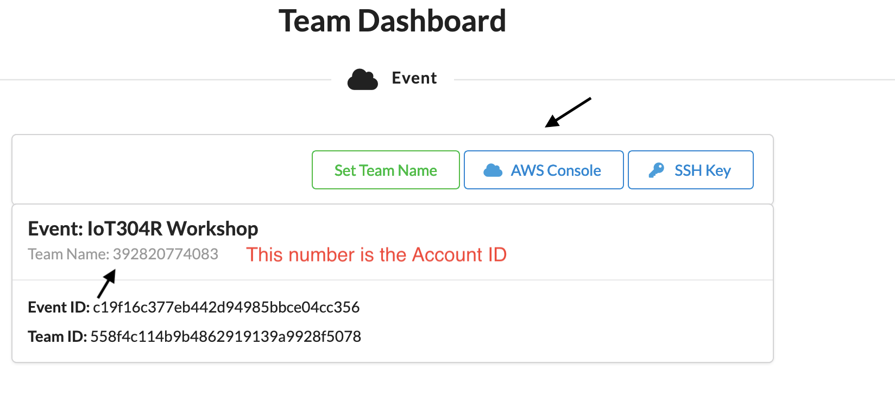
    
    - Click Open AWS console

    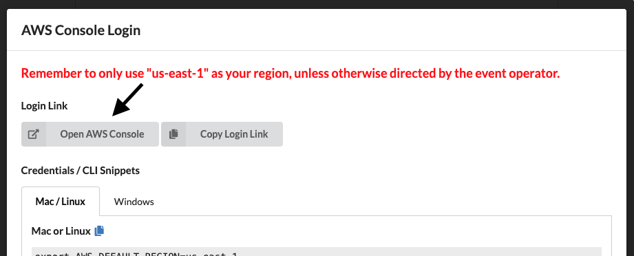

3. Please navigate to the [AWS IoT Console](https://console.aws.amazon.com/iot/) 

    - Click Get started (if prompted)
    - select Manage -> Things 
        - copy the name of the Thing (on the right pane)
    - This is the serial # of your device (NxP kit) , that you need in step 5 

    
    
3. Please navigate to the [AWS IoT Console](https://console.aws.amazon.com/iot/)           
    - click *Settings* (left bottom pane)
    - copy the IoT endpoint URL to a local notepad

    <font color="red">The endpoint Url might be different for you , than in the screenshot here</font>

    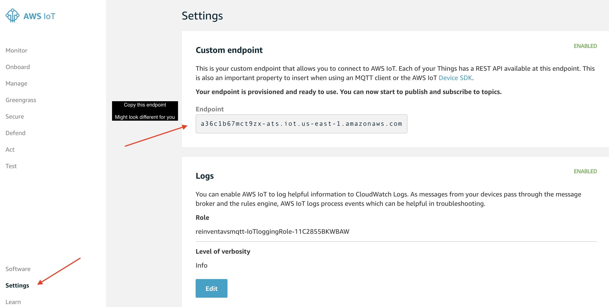

4. Click here to create [cloudformation-stack-us-east-1](https://console.aws.amazon.com/cloudformation/home?region=us-east-1#/stacks/create/review?stackName=reinventavsmqtt&templateURL=https://s3.amazonaws.com/alexa-reinvent/avs-iot-cfn.yaml)
    
    a. Enter the serial number, you copied earlier

    b. Leave rest of the options default and click Create

    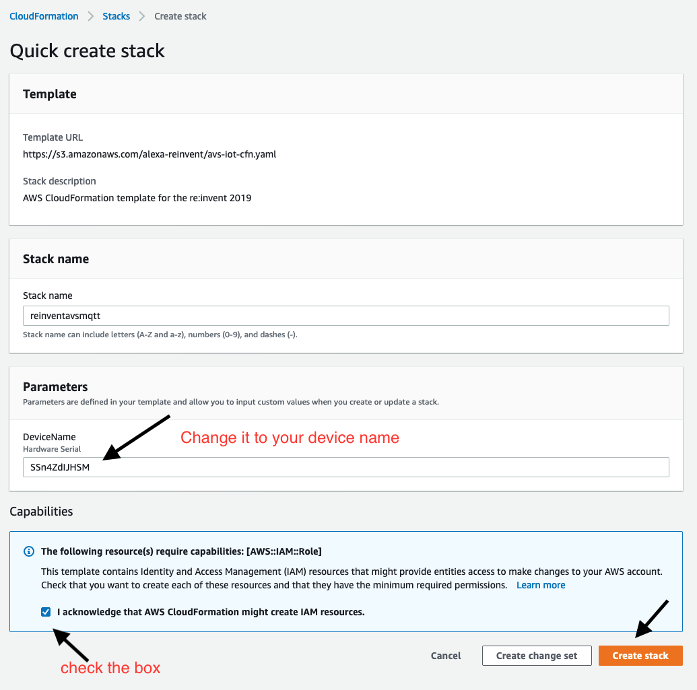

    <span style="color:orange">The cloudformation will take between 3-5 mins to complete. Once complete - </span>

## C. Create AVS Product  

After you've created an Amazon developer account, you'll need to create a product and security profile. This will enable your hardware kit (NxP) to connect to Alexa Voice Service.

Log in to [AVS console](https://developer.amazon.com/alexa/console/avs/home). 

If this is your first time using AVS, you'll see a welcome screen. Click the GET STARTED button, then click the CREATE PRODUCT button.

If you're a returning developer, click the Products -> CREATE PRODUCT button at the top right corner of the screen.

## <span style="color:orange"> Fill in product information</span>

1. Product Name: MQTT for AVS 

2. Product ID: PrototypeIoT

3. Please Select Your Product Type: Device with Alexa Built-in

    Will your device use a companion app?  **No**

    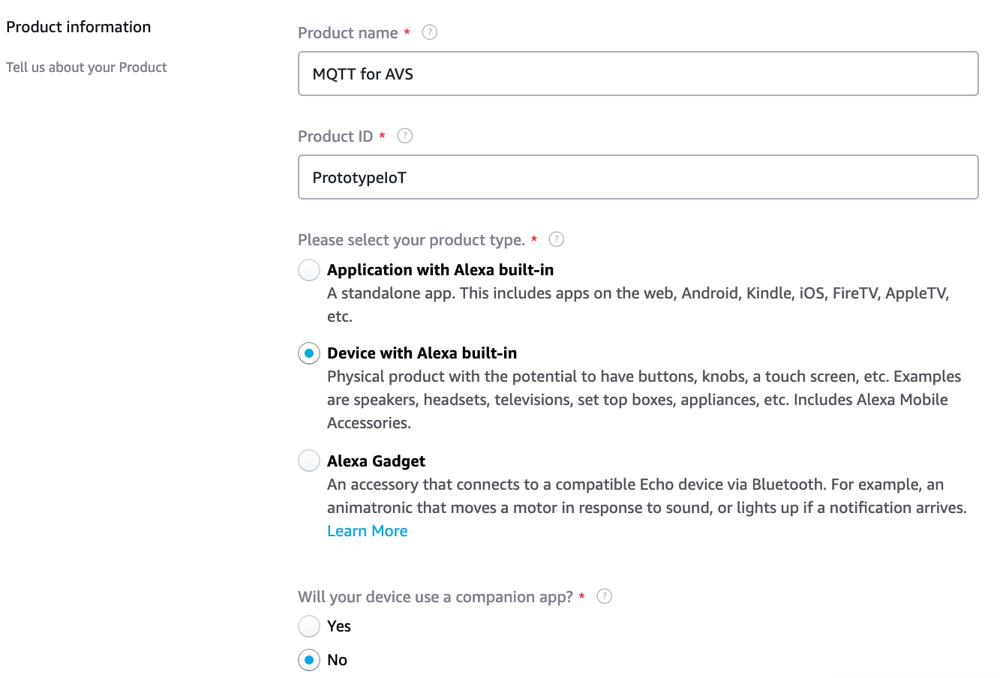

4. Product Category: Other (Please specify)
    - Enter Value: Prototype

5. Brief Product description: Prototype

6. How will users interact with your product? : Hands-free

    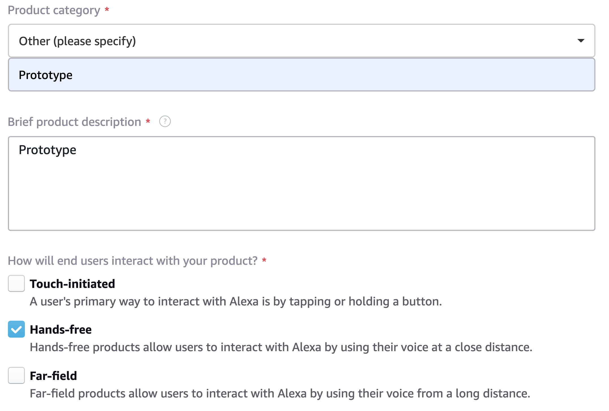

7. **Skip** the Upload an image step. This is not required for prototyping.

8. Select the options as below and click Next to Continue.

    <span style="color:orange">Please use the AWS Account # you copied in Section A - Step 1.</span>

    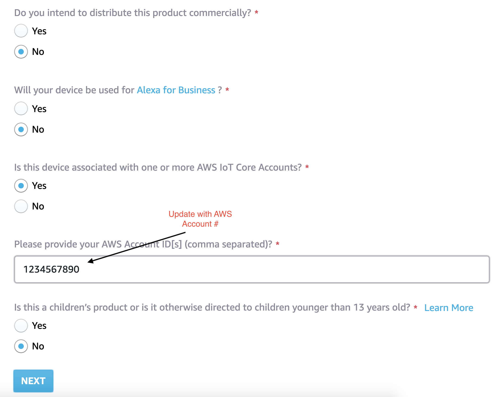

9. Click **CREATE NEW PROFILE**.


10. Enter your own custom Security Profile Name and Security Profile Description for the following fields - or use the below example names:
    - Security Profile Name: **MQTT for AVS Profile**
    - Security Profile Description: AVS IoT Workshop
    - Click NEXT.

    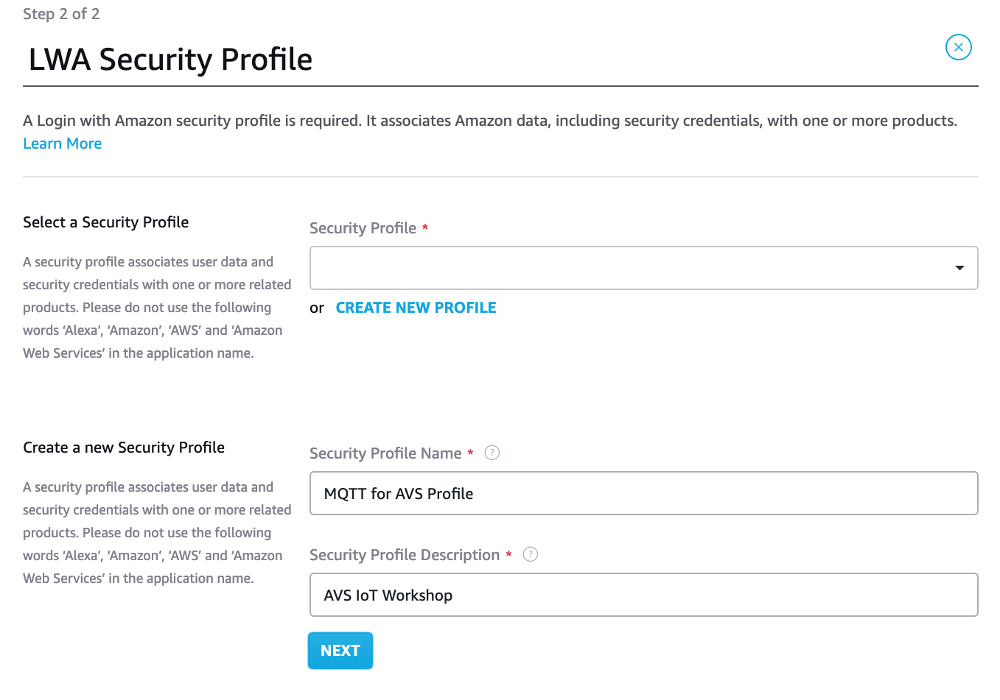

    **Security Profile ID** will be generated for you.

11. Select **Other devices and platforms** in the **Platform Information** section.

    - Client ID name -  **Prototype**
    - Click **Generate ID** and **Download**
        -  You will need the Client Id in the next section
    - Check the box **I agree to the AVS ..** and Click **FINISH**.

    

<span style="color:orange">You will get the message, Product has been created. Click Ok and move to section B.</span>
    <font color="orange">In the next lab you will need the following from this lab : </font>
    
    - AVS Client ID and Product ID available in the downloaded config.json file from Section A - Step 11

    - AWS IoT Endpoint Url from Section B - Step 4

Congratulations! You now have created the Alexa Voice Product and the AWS resources. In the next lab , you will embed these configurations on the hardware , so they can communicate with Alexa Voice service and AWS IoT services. 

### See you in [lab2](./lab2.md). 


