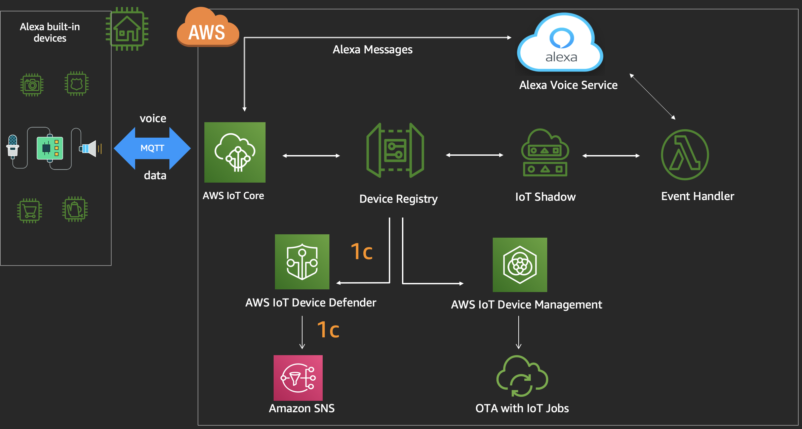
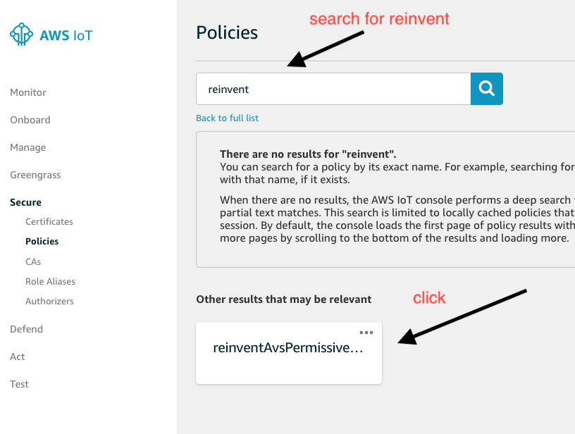
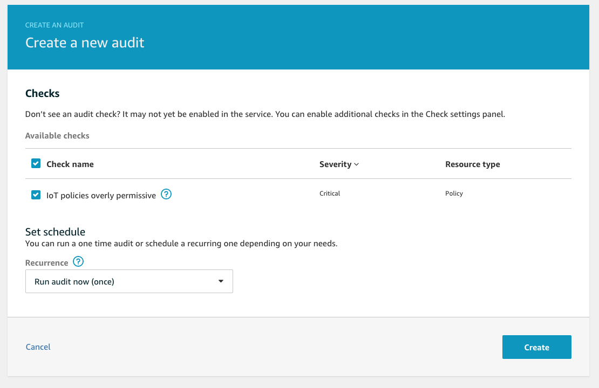
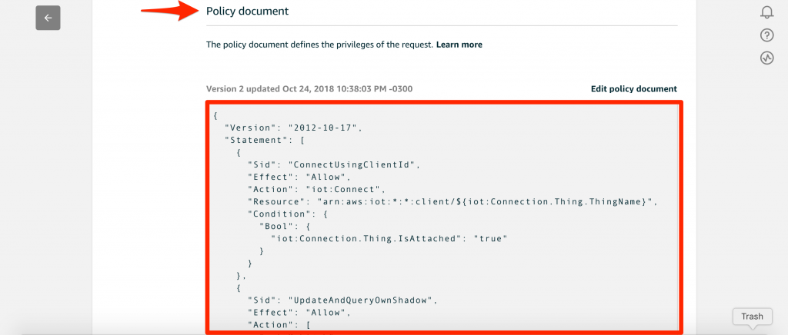

# Lab 4 : Secure your IoT Devices

In this lab, you will learn how to secure your Alexa enabled IoT devices from vulnerabilities. You will use IoT Device defender to create an Audit that will identify overly permissive policies. You will then create an automated security remediation pipeline to update those policies. 

##  You will build step 1c of this architecture :

## A. Configure Device Defender Audit settings 
Please login to the [AWS Lambda Console](https://console.aws.amazon.com/lambda/) and select *Applications* (on the left pane) -> reinventavsmqtt* application. 
1. Under Resources section, please select the Lambda function with Logical ID **DeviceDefenderAuditLambda**
2. Click the *Select a test event dropdown* (top right corner) -> Choose Configure test events. 
    -   A window will appear, keep everything default, put the Event name as **test** , click **Create** button
    -  This will configure the test event and bring you back to the lambda console 
3. Click on *Test* (top right corner) , check if the *Execution Result* is a success 
    - If it fails, check the logs to identify the problem. Ask support staff for help. 

If step 3 is a success, proceed to validate if the audit settings are applied.

## B. Audit device configurations 

1. Navigate to the [AWS IoT Console](https://console.aws.amazon.com/iot/) home page and click Defend (on the left pane) -> Settings 

    a. Check the audit "IoT policies overly permissive" is enabled (on the right pane). 

    b. Scroll down and Check the SNS alerts are configured

2. Navigate to Secure -> Policies (on the left pane) and click on the policy "reinventAvsPermissiveIoTPolicy" 

    a. You will notice the policy is wide open for all resources and actions. 

    

    In step 3 below, you will create an audit , which will identify any overly permissive policy in the AWS account and restrict it according to customer defined best practices. 

2. Navigate to Defend -> Audit -> View Audit Results -> Click Create (right top corner)

    Keep everything as default and click Create 

     
    

    You will be directed to the Audit Results page, please wait for the task to finish. It might take up-to 5 mins. 

3. If the task is a success , please navigate back to Secure -> Policies (on the left pane) and click on the policy "reinventAvsPermissiveIoTPolicy". 

    -  You will notice the policy is now restricted. 

    

Navigate to the [AWS Lambda Console](https://console.aws.amazon.com/lambda/) and select *Applications* (on the left pane) -> reinventavsmqtt* application. 

4. Under Resources section, please select the Lambda function with Logical ID **DevDefenderResultsProcessorLambda**

    -  Please check the lambda function code to understand , how the audit results are processed in real time, to remediate vulnerabilities on the IoT policy. 

Congratulations! You now have succesfully built a security remediation pipeline, that will protect your devices in an automated fashion. 

### See you in [lab5](./lab5.md)
