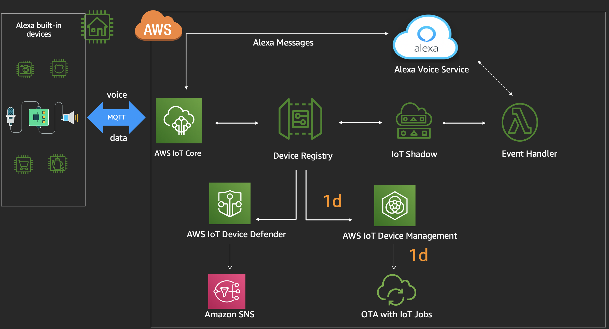
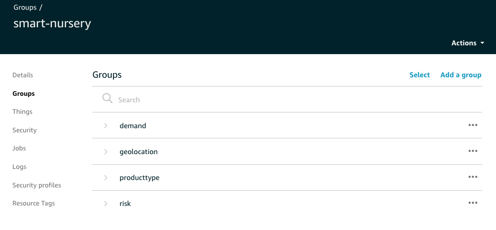
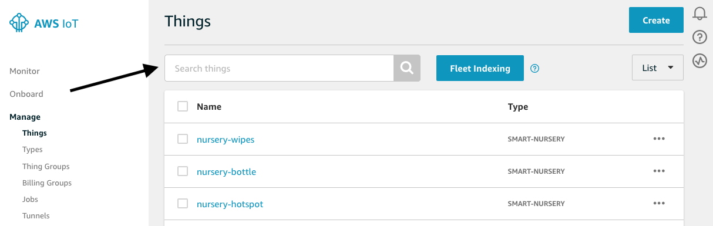
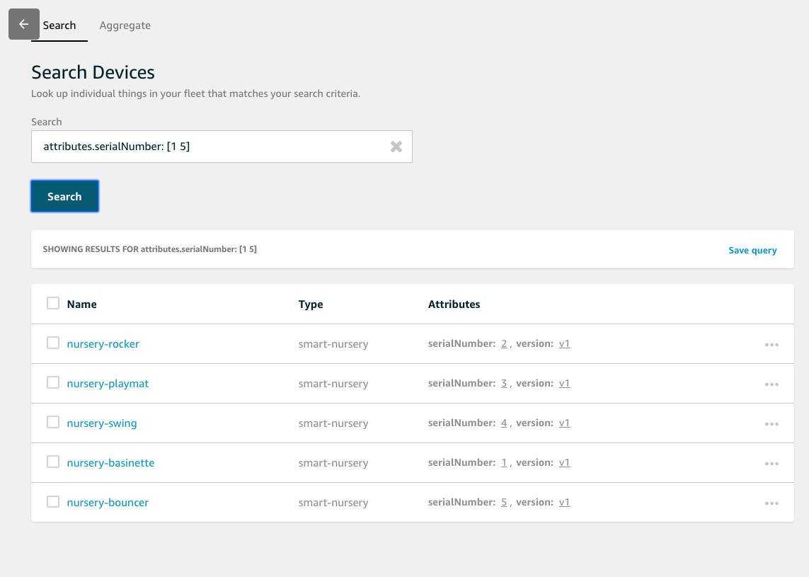
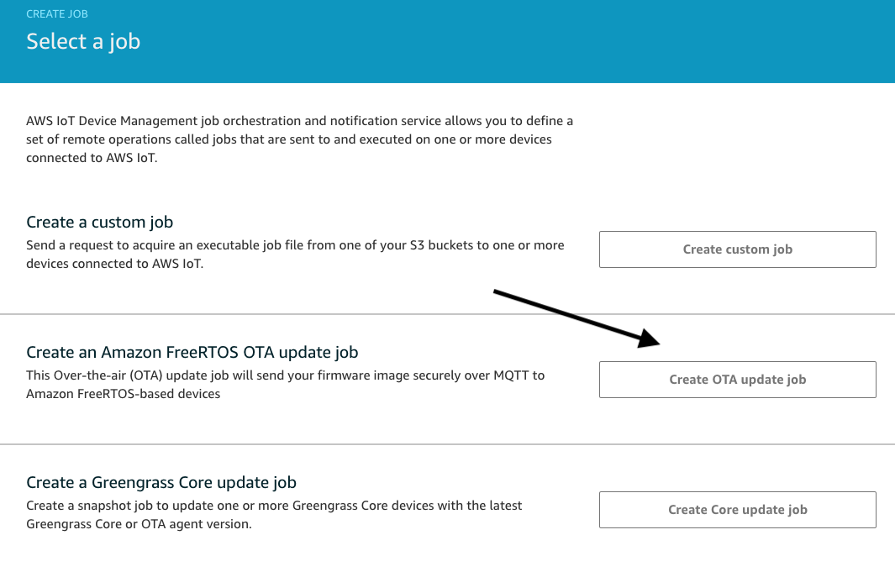
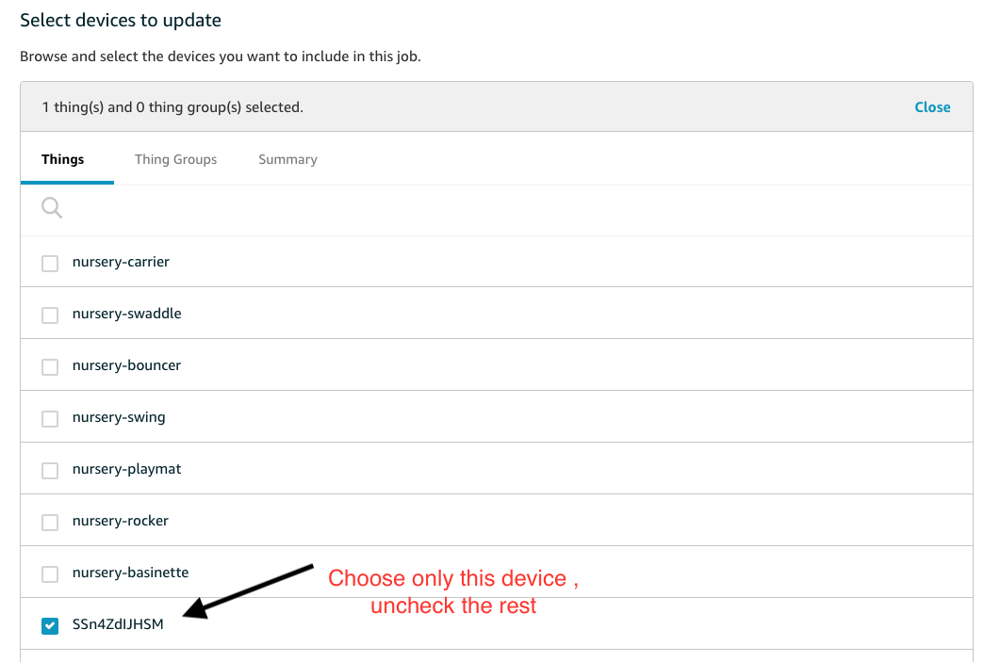
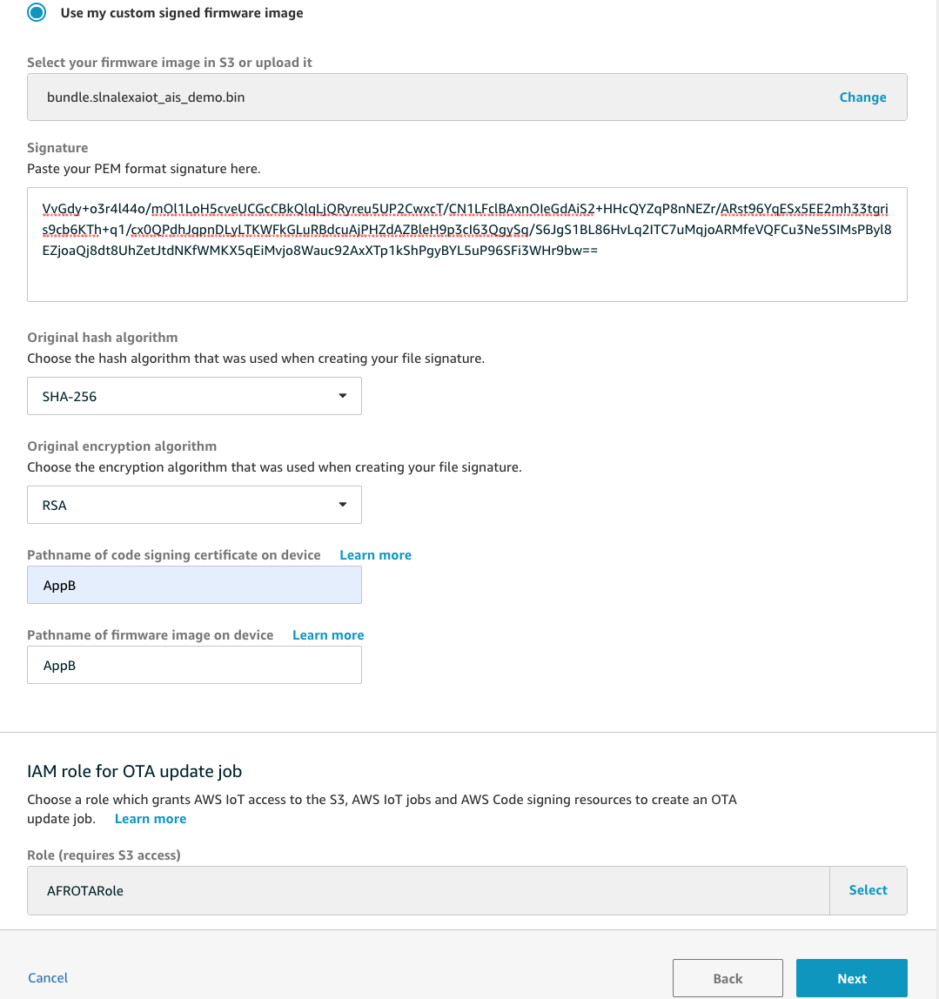
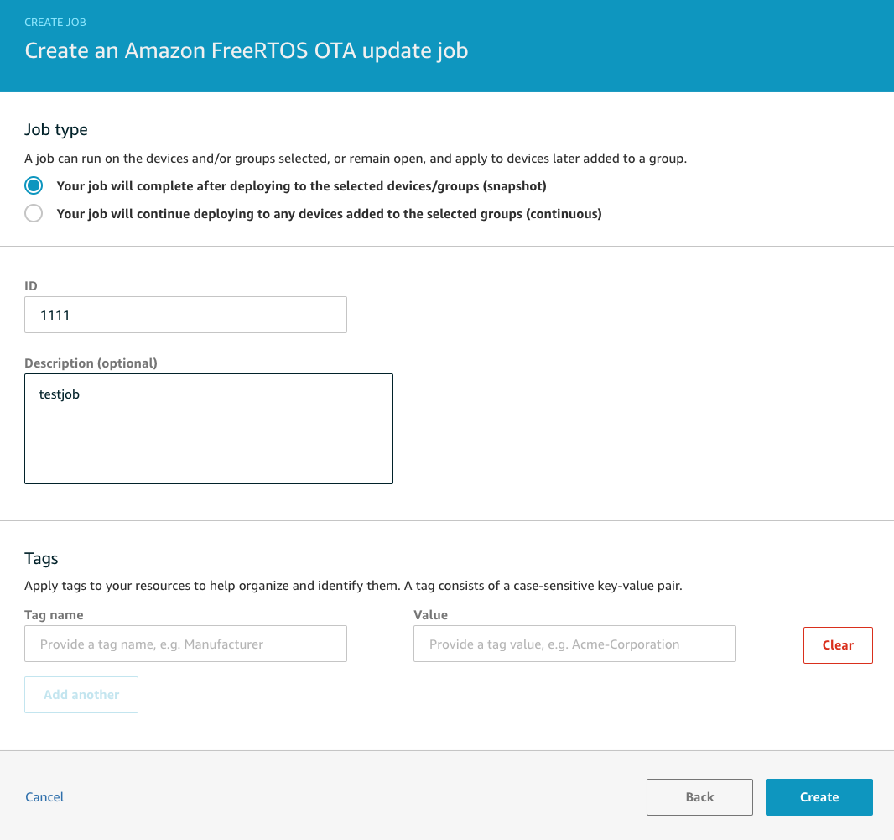

# Lab 5 : Bulk provision and Operate Alexa enabled IoT Devices

In the last few labs , you have configured a hardware kit to be Alexa enabled and successfully registered it with AWS IoT Core. In the real world, you might need to provision hundreds of thousands of these devices. In this lab, you will learn how to bulk provision fleet of IoT devices, organize and manage them using IoT Device Management. You will also learn to perform search operations on these devices. Finally you will learn how to perform an over the air update on your IoT devices using IoT jobs.  

## <span style="color:orange"> You will build step 1d of this architecture :</span>


## A. Bulk provision your fleet

<span style="color:orange">You will bulk provision your fleet using a lambda function created for you. Please look into the code to learn more about the steps. </span>

Please login to the [AWS Lambda Console](https://console.aws.amazon.com/lambda/) and select *Applications* (on the left pane) -> reinventavsmqtt* application. 
1. Under Resources section, please select the Lambda function with Logical ID **DeviceManagementLambda**

2. Click the *Select a test event dropdown* (top right corner) -> Choose Configure test events. 
    -   A window will appear, keep everything default, put the Event name as **test** , click **Create** button
    -  This will configure the test event and bring you back to the lambda console 

    

3. Click on *Test* (top right corner) , check if the *Execution Result* is a success 
    - If it fails, check the logs to identify the problem. Ask support staff for help. 

<span style="color:lightgreen">If step 3 is a success, proceed to validate if the fleet is provisioned.</span>

Please navigate to the [AWS IoT Console](https://console.aws.amazon.com/iot/) and select *Manage* (on the left pane) -> *Things*

4. Under Things section , you see all the  *nursery* devices that are created for you using the cloudformation template

6. On the [AWS IoT Console](https://console.aws.amazon.com/iot/) click on Manage -> Thing Groups -> smart-nursery
    - Click on the Groups tab , You will find multiple parent & child groups 
    - Click on the Things tab, and feel free to associate different things to different groups.

    


## B. Search your fleet

<span style="color:orange">In the real world, you need to have a quicker way to identify specific things from your fleet of devices. So lets try the search operation now. </span>

7. Navigate to the [AWS IoT Console](https://console.aws.amazon.com/iot/) home page again and click on *Manage* (on the left pane) -> *Things*
8. Click on *Search Things* textbox -> Choose Search (*Locate or identify specific devices*)

    

    - Try the following operations in the search box  -
        
        a. Find all things with serial numbers betweeen 1 to 5 
        ```
        attributes.serialNumber: [1 5]
        ```
        Copy the above statement in the Search textbox and Click *Search*

        

        b. Find all things with firmaware version v1 and disconnected at this time  
        ```
        attributes.version: "v1" AND connectivity.connected: false
        ```
        Copy the above statement in the Search textbox and Click *Search*

        c. Find all things, with reported status HIGH / LOW
        ```
        shadow.reported.brightness: "HIGH" OR "LOW"
        ```
        Copy the above statement in the Search textbox and Click *Search*.
        
        Feel free to try other search operations that you like. 

## C. Perform Over the Air Update 

<span style="color:orange">Once you have identified the things with old firmware and found them inactive , you may need to update them over the air with the latest code. You can choose to update a single device or a fleet of devices. In this lab since we have only one real device (aka the NxP kit), we will only update that. </span>

9. On your laptop, check the firmware version on the NxP kit through the serial console :  
```
SHELL>version 
```
    It should show version 1.0.6

10. Download the firmware image and the code signing signature file for your laptop from here and unzip it here ->  [codesigning.zip](https://alexa-reinvent.s3.amazonaws.com/codesigning.zip)

11. Navigate to the [AWS IoT Console](https://console.aws.amazon.com/iot/) again and click on *Manage* (on the left pane) -> *Jobs*

12. Click on Create a job -> Create OTA update job

    

    a. Choose only the NxP device from the drowndown -> Click Next

    

    b. Select *Use my custom signed firmware image* 

    c. Choose the s3 bucket titled *reinvent-afrota/** and upload the image ending with *bundle\*.bin* downloaded from step 10 above

    d. Open the code signing signature file downloaded from step 10 above and paste the content into the Signature textbox

    e. Choose the Hash Algorithm as SHA-256

    f. Choose the original encryption algorithm as RSA 

    g. For the 2 pathname textboxes , type "AppB" 

    h. Choose the IAM role matching  reinvent\*AFROTARole\* in the dropdown and click Next 

    

    i. Choose Job type as "job will complete after deploying to selected devices.."

    j. Put a random ID # and click Create 

    

    <span style="color:lightgreen">The led will turn blue and the job should take around 5-7 mins to complete. Check if the job status is complete and DONOT power off the kit during the process. 


13. On your laptop, check the firmware version on the NxP kit through the serial console again :  
```
SHELL>version 
```
    It should show version 2.0.0 

<span style="color:orange"> Please note, the NxP kit used in this workshop is a MCU running Amazon FreeRTOS. Thus you chose the freertos custom OTA option here. If you have a CPU based device (s) you had to choose *Create custom job* option.</span>

Congratulations! You now have  bulk provisioned your fleet of devices, operated them at scale and performed OTA update to upgrade it to the latest firmware. 

### [Back to Home Page](../readme.md)
