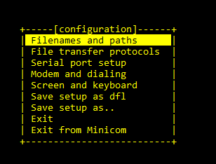
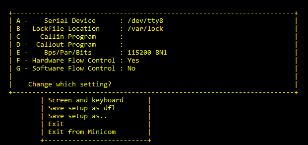
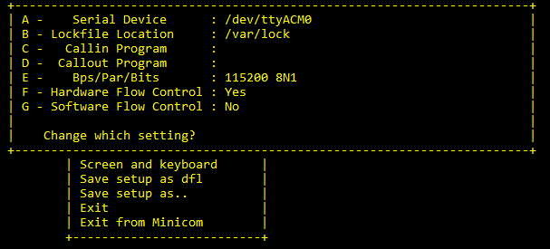
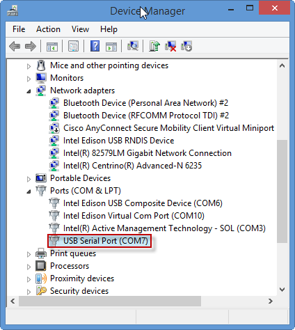
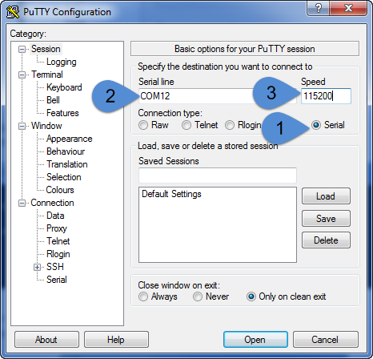

# Mac : Connect over serial terminal

1. Launch Spotlight by pressing Cmd + Space

2. Type terminal

3. Select the Terminal app

4. In the Terminal window, enter the command: 
    ```
    ls /dev/cu.usb*
    ```
5. In the list of connected devices, look for a device that contains cu.usbmodem*

6. Connect to the USB serial device using the Terminal screen utility by entering the command: 
    
    Please replace XXXXX in the following command with the modem number you got back from step 5
    ```
    screen /dev/cu.usbmodemXXXXX 115200 -L
    ```

7. Once you are connected , you will see a blank screen , press enter twice and SHELL interface will appear. 
    ```
    SHELL>>
    ```

<span style="color:orange">To end a session in Screen, type Ctrl + A then Ctrl + K. You will be prompted to end the session, press y.</span>

### Continue with [lab2](./lab2.md) from section 3 onwards. 


# Linux : Connect over serial terminal

1. Open a new Terminal window. Enter the command: 

    ```
    ls /dev/tty∗
    ```
    
    Then ’/dev/ttyACM0’ is found.

2. In the terminal window, configure the ttyACM0 as the default console, so run

    ```
    sudo minicom -s
    ```

    The ttyACM0 can be opened successfully and user can input characters by using the minicom.

3. Navigate to Serial Port setup 

    

4. Select A 

    

5. Modify the serial Device to /dev/ttyACM0

    

    Press enter twice to confirm the changes

6. Select save setup as dfl to save the configuration

    

    Select Exit 


### Continue with [lab2](./lab2.md) from section 3 onwards. 


# Windows : Connect over serial terminal

1. Open Device Manager. A COM port is enumerated in the Device Manager. 
    -  If it prompts for CDC driver installation, see the Drivers section below to install the CDC driver. 

    

2. Open the COM port in a terminal tool, such as Putty.
    - Download the PuTTY terminal emulator [here](http://the.earth.li/~sgtatham/putty/latest/x86/putty.exe)

3. Once connected to the COM Port through Putty, Type the commands as below :
    
    

## Drivers 
1. if issues with drivers on windows, please refer to detailed [instructions](https://alexa-reinvent.s3.amazonaws.com/Drivers.zip) here. 
    - Reach out to AWS support staff for the drivers software. 


### Continue with [lab2](./lab2.md) from section 3 onwards. 


