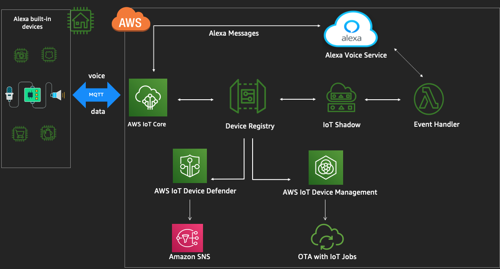

# Build Voice Controlled home devices with AWS IoT and Alexa 

In this workshop, you will learn to build an Alexa device and how you can manage and secure these devices using AWS IoT services. We want to teach you the building blocks for implementing IoT solutions on voice enabled devices. You'll configure Amazon FreeRTOS on the hardware, configure it to connect to Alexa voice service and interact with custom Alexa skills. Then you will onboard fleet of devices to AWS IoT Core, manage the devices using AWS IoT Device Management and secure the fleet using AWS IoT device defender. 

# Please ensure you have the below setup, before you proceed with the labs :

### Prerequisites 
1. Laptop (Windows / Mac / Linux)
2. Amazon Developer Account
    - [Create one here in **US region** if you dont have](https://developer.amazon.com/login.html) 
3. To be provided for the workshop by AWS :
    - AWS Account ID  
    - NxP hardware kit 
4. Browser 
    - Chrome / Firefox

<!-- ### Software on the laptop
1. Serial terminal - Click the below links for instructions
    -   Mac -  [screen](./instructions/serial.md)    
    -   Windows - [putty](./instructions/serial.md)
    -   Linux -  [minicom](./instructions/serial.md) 

**Once you are done with the setup above , please start with Lab1.**  -->

# You will be doing the labs below  -

- Lab 1 : [Create Alexa Voice Product and AWS resources](./instructions/lab1.md)
- Lab 2 : [Enable Alexa on the NxP MCU kit](./instructions/lab2.md)
- Lab 3 : [Command and Control Alexa enabled IoT device(s)](./instructions/lab3.md)

# Bonus section - 
- Lab 4 : [Secure Alexa enabled IoT devices](./instructions/lab4.md)
- Lab 5 : [Bulk provision and Operate Alexa enabled IoT Devices](./instructions/lab5.md)

# FAQ  - 
- [Answers](./instructions/faq.md) to some common questions

# You are going to build the below solution today -

